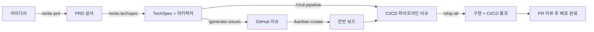

# cc-sdlc — 소프트웨어 개발 자동화 Claude Code 스킬 패키지

소프트웨어 개발 전체 라이프사이클(기획 → 설계 → 이슈 관리 → 구현 → CI/CD)을 자동화하는 **Claude Code 커스텀 스킬** 7종 패키지입니다.

> **cc-sdlc** = Claude Code + Software Development Life Cycle

---

## 목차

1. [사전 준비](#1-사전-준비) (Node.js · Claude Code · gh CLI · **KANBAN_TOKEN**)
2. [설치](#2-설치)
3. [설치 확인](#3-설치-확인)
4. [사용 방법](#4-사용-방법)
5. [전체 워크플로우 예시](#5-전체-워크플로우-예시)
6. [제거](#6-제거)
7. [포함된 스킬](#포함된-스킬-7종)
8. [지원 도구 로드맵](#지원-도구-로드맵)

---

## 1. 사전 준비

cc-sdlc를 사용하기 전에 아래 도구들이 설치되어 있어야 합니다.

### Node.js 설치 확인

`npx` 명령어를 사용하려면 **Node.js 14 이상**이 필요합니다.

```bash
node --version   # v14.0.0 이상이어야 함
```

Node.js가 없다면 [nodejs.org](https://nodejs.org)에서 설치하세요.

### Claude Code 설치 확인

스킬은 Claude Code 환경에 설치됩니다. Claude Code가 실행되는지 확인하세요.

```bash
claude --version
```

### GitHub CLI 설치 확인 (칸반/이슈 스킬 사용 시 필요)

`/kanban-create`, `/implement` 등 GitHub 관련 스킬을 사용할 경우 필요합니다.

```bash
# 설치 여부 확인
gh --version

# 설치되어 있지 않다면 (macOS 기준)
brew install gh

# GitHub 계정 인증
gh auth login
```

---

### GitHub PAT(`KANBAN_TOKEN`) 발급 — 칸반 자동화에 필수

`/implement` 실행 후 PR을 열거나 머지하면 칸반 이슈가 자동으로 Review/Done 컬럼으로 이동합니다. 이 자동화가 동작하려면 **`KANBAN_TOKEN`이라는 이름의 PAT**를 **작업 대상 저장소의 Secret**으로 등록해야 합니다.

> GitHub Actions가 기본 제공하는 `GITHUB_TOKEN`은 Projects V2에 접근할 수 없기 때문에 별도 PAT가 필요합니다.

#### 1단계 — PAT 발급

1. 브라우저에서 👉 **https://github.com/settings/tokens/new** 접속 (GitHub 로그인 상태)
2. 아래 값으로 입력:
   - **Note**: `kanban-automation` (식별용 이름)
   - **Expiration**: `No expiration` (교육용) 또는 90 days
   - **Select scopes** — 아래 **4개 체크**:
     - ☑ `repo` (전체)
     - ☑ `project`
     - ☑ `read:org` (admin:org 하위)
     - ☑ `read:discussion`
3. 페이지 하단 초록 **Generate token** 버튼 클릭
4. 표시된 `ghp_xxxxxxxxx...` 값을 **즉시 복사** (한 번만 보입니다)

> ⚠️ **4가지 스코프 중 하나라도 누락되면 Actions 실행 시 오류가 납니다.**
> - `project` 누락 → `Resource not accessible by integration`
> - `read:org` 누락 → `missing required scopes [read:org]`

#### 2단계 — 저장소 Secret 등록 (**웹 UI 방식**, 권장)

1. 작업 대상 저장소로 이동 → 상단 **Settings** 탭 클릭
2. 좌측 사이드바에서 **Secrets and variables** → **Actions** 진입
   또는 직접 URL: `https://github.com/OWNER/REPO/settings/secrets/actions`
3. 초록 **New repository secret** 버튼 클릭
4. 입력:
   - **Name**: `KANBAN_TOKEN` ← **대소문자·철자 정확히**
   - **Secret**: 1단계에서 복사한 `ghp_...` 값을 붙여넣기
5. **Add secret** 클릭

등록 후 **Repository secrets** 목록에 `KANBAN_TOKEN`이 표시되면 성공입니다.

#### 2단계 (대체) — CLI 방식

```bash
gh secret set KANBAN_TOKEN --repo OWNER/REPO
# 프롬프트에 PAT 붙여넣기
```

#### 3단계 — 등록 확인

```bash
gh secret list --repo OWNER/REPO
# 출력에 "KANBAN_TOKEN    (등록일시)" 가 보이면 OK
```

> 💡 **토큰이 미등록이어도 PR 체크는 빨간 X로 실패하지 않습니다.** 워크플로우는 "KANBAN_TOKEN 미등록 — 칸반 이동 스킵" 알림만 남기고 성공으로 끝납니다. 토큰을 등록하는 순간부터 자동화가 작동합니다 *(graceful degradation 패턴)*.

---

## 2. 설치

터미널을 열고 아래 명령어 한 줄을 실행하면 7개의 스킬과 12개의 커맨드가 자동으로 설치됩니다.

```bash
npx github:ischung/cc-sdlc-v0
```

명령어를 실행하면 다음과 같은 화면이 출력됩니다.

```
╔══════════════════════════════════════════════╗
║     cc-sdlc — Claude Code SDLC Skills v1.0  ║
╚══════════════════════════════════════════════╝

[설치 시작]

  ▸ github-kanban
    ✔ 스킬 설치: ~/.claude/skills/github-kanban/SKILL.md
    ✔ 커맨드 설치: /kanban-add-issues
    ✔ 커맨드 설치: /kanban-create
    ✔ 커맨드 설치: /kanban-status

  ▸ write-prd
    ✔ 스킬 설치: ~/.claude/skills/write-prd/SKILL.md
    ✔ 커맨드 설치: /write-prd
  ...

[설치 완료]

  → 스킬:    7개  →  ~/.claude/skills
  → 커맨드:  12개  →  ~/.claude/commands

  Claude Code를 재시작하면 모든 스킬이 활성화됩니다.
```

설치가 완료되면 **Claude Code를 완전히 종료한 뒤 다시 실행**하세요. 재시작 후 모든 스킬과 커맨드가 활성화됩니다.

### 설치 위치

설치 명령어는 아래 두 폴더에 파일을 복사합니다.

```
~/.claude/
├── skills/               ← 스킬 정의 파일 (자동 트리거용)
│   ├── github-kanban/SKILL.md
│   ├── write-prd/SKILL.md
│   ├── write-techspec/SKILL.md
│   ├── ci-cd-pipeline/SKILL.md
│   ├── tdd/SKILL.md
│   └── github-flow-impl/SKILL.md
└── commands/             ← 슬래시 커맨드 파일
    ├── write-prd.md
    ├── write-techspec.md
    ├── generate-issues.md
    ├── kanban-create.md
    ├── kanban-add-issues.md
    ├── kanban-status.md
    ├── cicd-pipeline.md
    ├── tdd.md
    ├── implement.md
    └── impl.md
```

### 프로젝트 스코프 설치 (특정 프로젝트에서만 사용)

전역(`~/.claude/`) 대신 **프로젝트 폴더 내 `.claude/`** 에 설치하면 해당 프로젝트에서만 스킬이 활성화됩니다. 팀원이 없는 다른 프로젝트에 영향을 주지 않고, 스킬 버전을 프로젝트별로 고정하고 싶을 때 유용합니다.

```bash
# 프로젝트 폴더로 이동 후
cd /your-project
npx github:ischung/cc-sdlc-v0 --project

# 또는 경로를 명시
npx github:ischung/cc-sdlc-v0 --project /your-project
```

설치 위치:

```
/your-project/.claude/
├── skills/
│   ├── github-kanban/SKILL.md
│   ├── write-prd/SKILL.md
│   ├── write-techspec/SKILL.md
│   ├── ci-cd-pipeline/SKILL.md
│   ├── tdd/SKILL.md
│   └── github-flow-impl/SKILL.md
└── commands/
    └── (10개 커맨드)
```

> 프로젝트 스코프는 `.claude/` 디렉토리를 해당 프로젝트의 Git에 커밋하면 팀 전체가 동일한 스킬 버전을 공유할 수 있습니다.

### 로컬 소스에서 직접 설치 (개발/기여자용)

이 저장소를 직접 클론하여 수정한 뒤 설치할 수 있습니다.

```bash
# 1. 저장소 클론
git clone https://github.com/ischung/cc-sdlc-v0.git
cd cc-sdlc-v0

# 2-A. 전역 설치 (~/.claude/)
npx github:ischung/cc-sdlc-v0

# 2-B. 특정 프로젝트에만 설치
npx github:ischung/cc-sdlc-v0 --project /your-project

# 2-C. cc-sdlc-v0 폴더 자체에 설치 (현재 디렉토리)
npx github:ischung/cc-sdlc-v0 --project
```

스킬 파일을 수정한 뒤 재설치할 때도 동일한 명령을 반복 실행하면 됩니다 (덮어쓰기).

---

## 3. 설치 확인

설치가 제대로 되었는지 확인하려면 다음 명령어를 실행합니다.

```bash
# 전역 설치 현황
npx github:ischung/cc-sdlc-v0 list

# 프로젝트 스코프 설치 현황 (현재 디렉토리 기준)
npx github:ischung/cc-sdlc-v0 list --project
```

7개 스킬과 12개 커맨드 앞에 모두 ✔ 표시가 나오면 정상입니다.

```
[설치 현황]

  ✔  스킬: auto-ship
       ✔  /ship
       ✔  /ship-all
  ✔  스킬: ci-cd-pipeline
       ✔  /cicd-pipeline
  ✔  스킬: github-flow-impl
       ✔  /impl
       ✔  /implement
  ✔  스킬: github-kanban
       ✔  /kanban-add-issues
       ✔  /kanban-create
       ✔  /kanban-status
  ✔  스킬: tdd
       ✔  /tdd
  ✔  스킬: write-prd
       ✔  /write-prd
  ✔  스킬: write-techspec
       ✔  /generate-issues
       ✔  /write-techspec
```

---

## 4. 사용 방법

Claude Code를 열고 작업 중인 프로젝트 폴더에서 아래 커맨드를 사용합니다.  
슬래시 커맨드(`/커맨드명`) 또는 자연어로 입력하면 스킬이 자동으로 실행됩니다.

---

### 권장 실행 순서 (SDLC 흐름)

프로젝트 초기부터 운영까지 아래 순서로 실행하면 품질 게이트가 자연스럽게 먼저 서게 됩니다.

```mermaid
flowchart LR
    A[/write-prd<br/>기획] --> B[/write-techspec<br/>설계]
    B --> C[/generate-issues<br/>기능 이슈]
    C --> D[/kanban-create<br/>/kanban-add-issues]
    D --> E[/cicd-pipeline<br/>CI/CD 이슈 7개]
    E --> F1[/implement L0-L1<br/>CI Gate 우선]
    F1 --> F2[/implement 기능 이슈<br/>+ /tdd]
    F2 --> G[/implement L2-L3<br/>CD 확장]
```

**`/cicd-pipeline`은 Kanban 생성 직후, 첫 `/implement` 전에 실행**하는 것을 권장합니다. 이유:

- **Shift Left**: CI가 첫 PR부터 회귀를 막음
- **TDD 강화**: `/tdd`의 Green 단계를 CI가 자동 검증
- **레벨별 병렬 구현**: 생성되는 이슈는 DAG 레벨로 묶여 발행되어, 같은 레벨(`[L1]`, `[L2]`, `[L3]`) 이슈는 서로 독립적으로 동시에 구현할 수 있습니다. 두 명 이상의 학생이 한 팀에서 병렬로 작업하기 좋은 구조입니다.

---

### `/write-prd` — PRD(제품 요구사항 문서) 작성

새 기능이나 프로젝트의 기획 문서를 작성할 때 사용합니다. AI가 PM 코치 역할을 맡아 8단계 질문을 통해 PRD를 완성해 줍니다.

```
/write-prd
```

또는 자연어로 입력해도 됩니다.

```
PRD 작성해줘
제품 기획서 만들어줘
```

**진행 순서:**

| 단계 | 내용 |
|------|------|
| Phase 0 | 아이디어 청취 — 만들고 싶은 것을 자유롭게 설명 |
| Phase 1 | 프로젝트 목표 정의 — 이 제품이 해결하는 핵심 문제 |
| Phase 2 | 범위 확정 — 이번 버전에서 할 것 / 하지 않을 것 |
| Phase 3 | 대상 사용자 & 유저 스토리 |
| Phase 4 | KPI 정의 — 성공 기준 지표 |
| Phase 5 | 상세 기능 요건 |
| Phase 6 | UI/UX 요건 |
| Phase 7 | 기술적 제약 & 최종 저장 |

각 단계마다 AI가 질문을 하고, 답변을 승인하면 다음 단계로 진행됩니다. 완료되면 `prd.md` 파일로 저장됩니다.

---

### `/write-techspec` — TechSpec(기술 명세서) 작성

PRD를 기반으로 시스템 아키텍처, 데이터 모델, API 명세를 포함한 기술 명세서를 작성합니다. 먼저 `/write-prd`로 PRD를 완성한 뒤 실행하세요.

```
/write-techspec
```

또는 자연어로 입력해도 됩니다.

```
TechSpec 작성해줘
기술 명세서 만들어줘
```

TechSpec에는 다음 내용이 포함됩니다.

- 시스템 아키텍처 다이어그램 (Mermaid)
- 기술 스택 선택 근거
- 데이터 모델 및 ERD
- REST API 명세
- 프론트엔드 / 백엔드 상세 기능 명세
- 개발 마일스톤 (Phase 1 ~ 4)

---

### `/generate-issues` — GitHub 이슈 자동 발행

TechSpec을 분석하여 개발 작업을 GitHub 이슈로 자동 분할하고 등록합니다. `/write-techspec`으로 TechSpec을 완성한 뒤 실행하세요.

```
/generate-issues
```

또는 자연어로 입력해도 됩니다.

```
이슈 발행해줘
GitHub 이슈 만들어줘
```

INVEST 원칙(Independent · Negotiable · Valuable · Estimable · Small · Testable)에 따라 작업 단위를 분割하여 이슈를 생성합니다.

---

### `/kanban-create` — GitHub Projects 칸반 보드 생성

현재 GitHub 저장소에 **Todo / In Progress / Review / Done** 4개 컬럼으로 구성된 칸반 보드를 자동으로 생성합니다.

```
/kanban-create
```

또는 자연어로 입력해도 됩니다.

```
칸반 보드 만들어줘
GitHub 프로젝트 생성해줘
```

> **전제 조건:** `gh auth login`으로 GitHub 인증이 완료되어 있어야 합니다.

---

### `/kanban-add-issues` — 칸반 보드에 이슈 추가

저장소의 열린 이슈 전체를 칸반 보드의 Todo 컬럼에 자동으로 배치합니다.

```
/kanban-add-issues
```

---

### `/kanban-status` — 칸반 보드 현황 조회

현재 칸반 보드의 컬럼별 이슈 수와 목록을 요약해서 보여줍니다.

```
/kanban-status
```

---

### `/cicd-pipeline` — CI/CD 파이프라인 구축

프로젝트의 언어와 구조를 분석하여 GitHub Actions 기반 CI/CD 파이프라인을 구성하는 이슈 7개를 자동으로 생성합니다.

```
/cicd-pipeline
```

또는 자연어로 입력해도 됩니다.

```
CI/CD 파이프라인 구축해줘
GitHub Actions 설정해줘
```

생성되는 이슈 목록 (DAG 레벨별 병렬 그룹):

| 레벨 | 이슈 | 병렬 여부 |
|------|------|-----------|
| L0 | 기존 워크플로우 정리 | 단독 |
| L1 | CI — Static Analysis & Security Scan | **L1 내 병렬** |
| L1 | CI — Unit/Integration Test (CI Gate) | **L1 내 병렬** |
| L2 | CD — Docker Build & Push | **L2 내 병렬** |
| L2 | CD — GitHub Pages 배포 & Smoke Test | **L2 내 병렬** |
| L3 | CD — Container Security Scan | **L3 내 병렬** |
| L3 | CD — Staging 배포 & E2E Test | **L3 내 병렬** |

동일 레벨의 이슈는 서로 의존하지 않아 **별도 브랜치로 동시에 구현**할 수 있습니다. 이슈 제목 접두어 `[L<n>]`이 레벨을 나타냅니다.

---

### `/tdd` — TDD 워크플로우

테스트 주도 개발(Test-Driven Development) 방식으로 기능을 구현할 때 사용합니다. AI가 Red → Green → Refactor 사이클을 단계별로 안내합니다.

```
/tdd 로그인 기능 구현
```

또는 자연어로 입력해도 됩니다.

```
TDD로 구현해줘
테스트 먼저 짜줘
```

**진행 순서:**

| 단계 | 내용 |
|------|------|
| STEP 0 | TODO 테스트 목록 생성 — 구현할 기능을 테스트 케이스로 분해 |
| STEP 1 (RED) | 실패하는 테스트 작성 — AAA 패턴(Arrange · Act · Assert) 적용 |
| STEP 2 (GREEN) | 최소한의 코드 작성으로 테스트 통과 |
| STEP 3 (REFACTOR) | 동작을 유지하면서 코드 품질 개선 |

---

### `/implement` — GitHub 이슈 자동 구현

칸반 보드의 Todo 컬럼에서 이슈를 선택하여 GitHub Flow 방식으로 자동 구현합니다. 브랜치 생성 → 코드 작성 → PR 생성까지 자동으로 처리합니다.

```
/implement          # Todo 컬럼의 최우선 이슈 자동 선택
/implement #42      # 이슈 번호 직접 지정
/impl               # /implement 단축 커맨드
```

**전제 조건:**

- `gh` CLI 2.x 이상이 설치되어 있어야 합니다.
- `jq`가 설치되어 있어야 합니다. (`brew install jq`)
- GitHub 인증 스코프: `repo`, `read:org`, `read:discussion`, `project`
- `KANBAN_TOKEN` PAT를 GitHub Actions Secret으로 등록 → [§1 사전 준비 - PAT 발급](#github-patkanban_token-발급--칸반-자동화에-필수) 참조

---

### `/ship` — 이슈 구현 + CI/CD 통과 자동화

칸반 보드의 Todo 이슈를 선택하여 구현하고, **CI/CD 파이프라인이 통과할 때까지 자동으로 처리**합니다. CI/CD 실패 시 실패 로그를 분석하여 자동 수정 후 재시도합니다. (최대 3회)

```
/ship           # Todo 최상단 이슈 자동 선택
/ship #42       # 이슈 번호 직접 지정
```

**`/implement`와의 차이:**

| 기능 | `/implement` | `/ship` |
|------|:-----------:|:-------:|
| 브랜치 생성 | ✅ | ✅ |
| 코드 구현 | ✅ | ✅ |
| 로컬 테스트 | ✅ | ✅ |
| PR 생성 | ✅ | ✅ |
| CI/CD 모니터링 | ❌ | ✅ |
| 실패 자동 수정 | ❌ | ✅ (최대 3회) |
| 실패 로그 분석 | ❌ | ✅ |

---

### `/ship-all` — Todo 이슈 전체 일괄 자동화

Todo 컬럼의 모든 이슈를 **DAG 레벨 순서**(`[L0]` → `[L1]` → `[L2]` → `[L3]` → 기능 이슈)에 따라 순차 처리합니다. 각 이슈마다 `/ship` 로직을 실행하므로 CI/CD 피드백 루프가 포함됩니다.

```
/ship-all               # Todo 이슈 전체 처리
/ship-all --skip #7     # 이슈 #7을 건너뛰고 처리
```

처리 순서 예시:

```
레벨 0: [L0][CI/CD] 기존 워크플로우 정리
레벨 1: [L1][CI] Static Analysis  +  [L1][CI] Unit Test (순차)
레벨 2: [L2][CD] Docker Build     +  [L2][CD] GitHub Pages (순차)
레벨 99: 로그인 구현, 회원가입 API, ... (기능 이슈들)
```

처리 중 특정 이슈에서 3회 초과 실패 시 해당 이슈를 건너뛰고 나머지 이슈를 계속 처리합니다.

**전제 조건:**

- `/implement`와 동일 + CI/CD 파이프라인이 구성된 저장소 권장
- CI/CD 없는 저장소에서도 동작합니다 (CI/CD 모니터링 단계 자동 스킵)

---

## 5. 전체 워크플로우 예시

새 프로젝트를 시작할 때 cc-sdlc 스킬을 순서대로 사용하는 예시입니다.



**단계별 실행 순서:**

```
1단계: /write-prd          → 기획 문서(prd.md) 완성
2단계: /write-techspec     → 기술 명세서 완성
3단계: /generate-issues    → GitHub 이슈 자동 등록
4단계: /kanban-create      → 칸반 보드 생성
5단계: /kanban-add-issues  → 이슈를 보드에 배치
6단계: /cicd-pipeline      → CI/CD 파이프라인 이슈 생성
7단계: /ship-all           → Todo 이슈 전체 자동 구현 + CI/CD 통과까지 처리
       /ship               → 이슈 하나씩 처리 (CI/CD 피드백 루프 포함)
       /implement          → CI/CD 모니터링 없이 PR 생성까지만 처리
       /tdd                → 각 기능을 TDD로 검증 (ship 내부에서도 활용)
```

---

## 6. 제거

설치된 모든 스킬과 커맨드를 제거하려면 다음 명령어를 실행합니다.

### 전역 제거

```bash
npx github:ischung/cc-sdlc-v0 uninstall
```

실행하면 `~/.claude/skills/` 안의 7개 스킬 폴더와 `~/.claude/commands/` 안의 12개 커맨드 파일이 삭제됩니다.

### 프로젝트 스코프 제거

프로젝트 내 `.claude/` 디렉토리에 설치했던 스킬만 제거하려면:

```bash
cd /your-project
npx github:ischung/cc-sdlc uninstall --project

# 또는 경로 명시
npx github:ischung/cc-sdlc uninstall --project /your-project
```

프로젝트 스코프 제거 시 `.claude/` 하위 빈 디렉토리도 자동으로 정리됩니다 (다른 스킬은 건드리지 않음).

### 프로젝트 스코프 제거

프로젝트 내 `.claude/` 디렉토리에 설치했던 스킬만 제거하려면:

```bash
cd /your-project
npx github:ischung/cc-sdlc-v0 uninstall --project

# 또는 경로 명시
npx github:ischung/cc-sdlc-v0 uninstall --project /your-project
```

프로젝트 스코프 제거 시 `.claude/` 하위 빈 디렉토리도 자동으로 정리됩니다 (다른 스킬은 건드리지 않음).

```
[제거 시작]

  ▸ github-kanban
    ✔ 스킬 제거: ~/.claude/skills/github-kanban
    ✔ 커맨드 제거: /kanban-add-issues
    ✔ 커맨드 제거: /kanban-create
    ✔ 커맨드 제거: /kanban-status
  ...

[제거 완료]

  → 7개 스킬이 제거되었습니다.
```

제거 후 **Claude Code를 재시작**하면 스킬이 비활성화됩니다.

---

## 포함된 스킬 (7종)

| 스킬 | 커맨드 | 설명 |
|------|--------|------|
| **write-prd** | `/write-prd` | 시니어 PM 코치가 1:1 대화로 PRD 단계별 완성 |
| **write-techspec** | `/write-techspec` `/generate-issues` | PRD → TechSpec 작성 + GitHub 이슈 자동 발행 |
| **github-kanban** | `/kanban-create` `/kanban-add-issues` `/kanban-status` | GitHub Projects 칸반 보드 자동 구성 |
| **ci-cd-pipeline** | `/cicd-pipeline` | GitHub Actions CI/CD 파이프라인 이슈 자동 생성 |
| **tdd** | `/tdd` | TDD(Red→Green→Refactor) 워크플로우 페어 프로그래밍 |
| **github-flow-impl** | `/implement` `/impl` | 칸반 보드 이슈 자동 선택 → GitHub Flow 구현 |
| **auto-ship** | `/ship` `/ship-all` | 이슈 구현 + CI/CD 파이프라인 통과까지 end-to-end 자동화 |

---

## 지원 도구 로드맵

| 도구 | 상태 |
|------|------|
| Claude Code | ✅ 지원 |
| OpenAI Codex CLI | 🔜 예정 |
| GitHub Copilot CLI | 🔜 예정 |

---

## 패키지 구조

```
cc-sdlc/
├── package.json
├── bin/
│   └── install.js       ← npx 진입점 (Node.js)
├── dist/                ← 배포용 스킬 번들
│   ├── github-kanban/
│   ├── write-prd/
│   ├── write-techspec/
│   ├── ci-cd-pipeline/
│   ├── tdd/
│   └── github-flow-impl/
└── README.md
```
